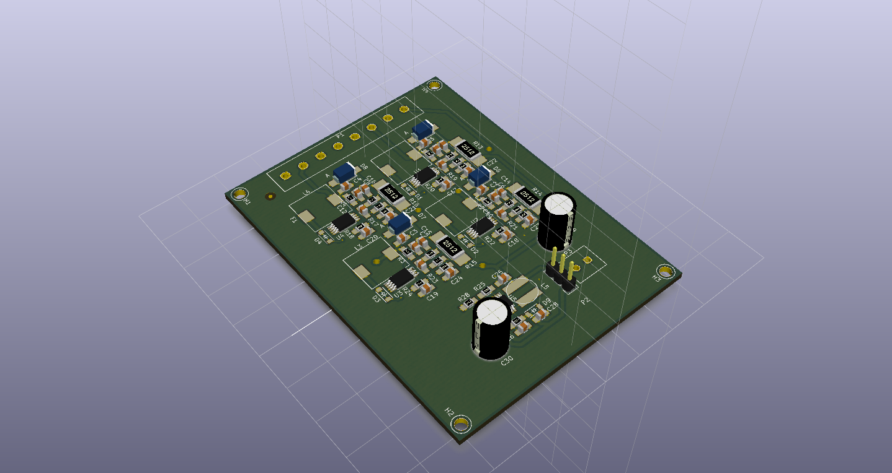
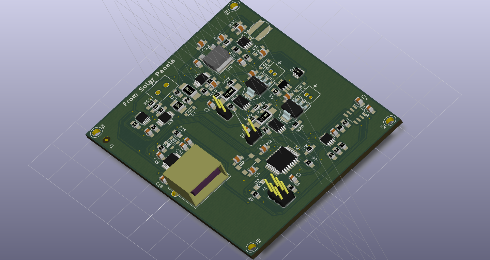

#RFCx PCB
@gibsjose @jesse-millwood @rfcx

##Description
This repository contains the **KiCad** project and related libraries for the RFCx PCB designed by Jesse Millwood and Joe Gibson for the GVSU (Grand Valley State University) RFCx Senior Project design, *Project Necromancer*.

This is the repository for two board designs. The main board consists of a microcontroller to relay sensor measurements of the local device environment (power consumption, temperature, and humidity) to the phone over a usb interface. The main board also consists of an LDO for the 3.3V rail and a step-up DC-DC switching regulator for the 5V rail to charge the phone. The MPPT board is for regulating the power from the solar panels and delivering it to the main board. These boards are kept separate so that they can be kept smaller and fit into a variety of enclosures. Another reason for keeping the design some what modular is that the main board or MPPT board can be swapped out or tested without affecting the other.

This README is meant to be a user guide for **REV 2** the two boards.

### Revision Overview
Rev1 of the board was a single board and was designed for one particular off-the-shelf enclosure.
Rev2 of the design is a modular design in order to introduce a degree of flexibility to the design.
Rev3 of the design will keep the modular design, however new components will be chosen based on testing of Rev2.

##Install Instructions
The chosen enclosure must take into consideration the size of the boards. Both of the boards measure at 63.5mm X 83.82mm(2.5" X 3.3"). The mounting holes are 2.54mm (0.1") offset from the corners. The installer must also take into consideration where the interfacing wires will be in relation to the other board. A list of interfacing wires that must be considered are:
* **MPPT BOARD:** 8 wires (4 power, 4 ground) from the terminal block to the solar panels
* **MPPT BOARD:** 2 wires (1 power, 1 ground) from the **MPPT BOARD** to the **Main Board**
* **Main Baord:** 2 JST connectors that go from the batter charging circuitry to the batteries
* **Main Board:** 2 JST connectors that interface to the NTC thermocouple. This thermocouple is meant to be glued or attached to the batteries.
* **Main Board:** 1 USBA to microUSB connector to the phone
Once the hardware connections are made it will be a good idea to ensure that the phone has the proper software installed such as the proper ROM and version of the Gaurdian app. For phone software refer to the [RFCx Guardian App](https://github.com/rfcx/rfcx-guardian-android) github page.

