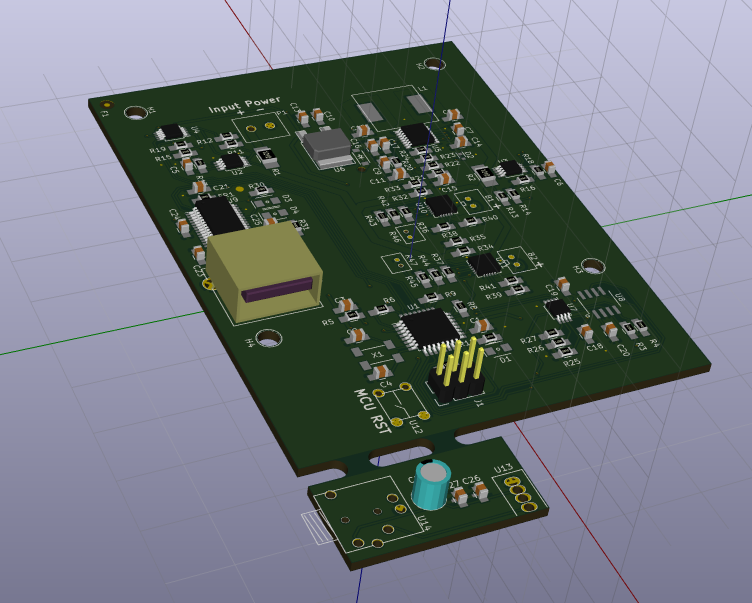

#RFCx Sentinel PCB
@gibsjose @jesse-millwood @rfcx



##Description
This repository contains the **KiCAD** project and related libraries for the RFCx PCB designed by Jesse Millwood and Joe Gibson for the GVSU (Grand Valley State University) RFCx Senior Project design, *Project Necromancer*. This project has been continued by Jesse Millwood and Joe Gibson after they graduated and has since been renamed *RFCx Sentinel*. 

This repository is for the main board that includes the following functionality:
- Buck/Boost input voltage to charge phone
- Regulate input power 3.3V to run the logic on the board
- Charge two Lithium Ion Batteries
- Take local measurements such as voltage, current, temperature, and humidity
- Relay information to the phone via a USB interface
- An experimental breakaway board for microphone filtering


This README is meant to be a user guide for the **REV 3** main board. 

###Revision Overview
Rev1 of the board was a single board and was designed for one particular off-the-shelf enclosure.
Rev2 of the design is a modular design in order to introduce a degree of flexibility to the design. This revision included an MPPT board and main board.
Rev3 of the design will keep the modular design, however new components will be chosen based on testing of Rev2. This revision is just the main board.

##Physical Install Instructions
The enclosure that is being used is the Polycase WP-33. The installer must take into consideration where the interfacing wires will be in relation to the other board. A list of interfacing wires that must be considered are:
* **Main Board:** Power from the panels.
* **Main Board:** 2 JST connectors that go from the batter charging circuitry to the batteries
* **Main Board:** 2 JST connectors that interface to the NTC thermocouple. This thermocouple is meant to be glued or attached to the batteries.
* **Main Board:** 1 USBA to microUSB connector to the phone
Once the hardware connections are made it will be a good idea to ensure that the phone has the proper software installed such as the proper ROM and version of the Gaurdian app. For phone software refer to the [RFCx Guardian App](https://github.com/rfcx/rfcx-guardian-android) github page.

##Outline of Directories
.  
├── Images  
│   ├── *Contains Images for the README*  
├── Kicad Project  
│   ├── Graphics  
│   │   ├── *Contains Graphics for the silk screen layer*  
│   ├── Graphics.pretty  
│   │   ├── *Contains `.kicad_mod` files to be placed on the silk screen layer*  
│   └── Main  
│       ├── *Contains schematic files (`.sch`) for the main board  
│       ├── Fabrication  
│       │   └── *Contains files for fabrication (Gerbers, BOM, Position, PDF)*  
│       │       Gerbers  
│       │       ├── *Contains Gerbers for the board manufacturers*  
│       │       Position  
│       │       ├── Inches  
│       │       │   ├── *Contains position file for top and bottom layers in inches*  
│       │       └── mm  
│       │           └── *Contains position file for top and bottom layers in mm*  
│       RFCx.pretty  
│       ├── *Contains module (footprint) files for components that needed to be made*  
│       Local-Libs  
│       └── *Contains schematic part libraries for parts that were made for this project*  
└── LICENSE  
    


## How to use this repository
1. Install KiCAD(4.0+) (http://kicad-pcb.org/download/)
2. clone the libraries and checkout a specific version
``` sh
mkdir -p ~/build
cd ~/build
git clone https://github.com/KiCad/kicad-library.git
cd kicad-library
git checkout 3c84dba8e473a325a17eae25ed3203d949589c10
mkdir build
cd build
cmake ..
make
make install
```
- A specific version of the KiCAD schematic libraries is used because sometimes they change. It is just safer to stick with one version though so there is little to no need to mess with the schematic symbols later
3. Download KiCAD footprints
4. Open the KiCAD application and load the project file.
- `File`-> `Open Project`
5. Open the `Mainboard.sch` file.
6. Tell KiCAD where the schematic symbol libraries are
- `Preferences`->`Component Libraries`
- Click the lower `Add` button and search for the `Local-Libs` directory if not already listed in the bottom pane of the window.
- Click the upper `Add` button and change to the `Local-Libs` directory. Select all of the `.lib` files and hit `Open`
- Click `Okay`


## Conventions for this project
- **Schematic Libraries:** The symbols in the `Local-Libs` libraries are to be used first. This is because I like how these symbols look. If the symbol is not there, use the symbols in `kicad-library`. If the symbol you are looking for isn't in any of those, make it your self, add it to the `Local-Libs` and make not of it in a pull request.
- **Footprint Libraries:** 
- **PCB Canvas:** Editing of the PCB should be done in the GAL mode of `pcbnew`. This is because some things are handled slightly differently in the other canvases.
- **
- **Units:** Use Imperial units when editing/laying out so an object/trace is not located at some odd fraction of an inch.


